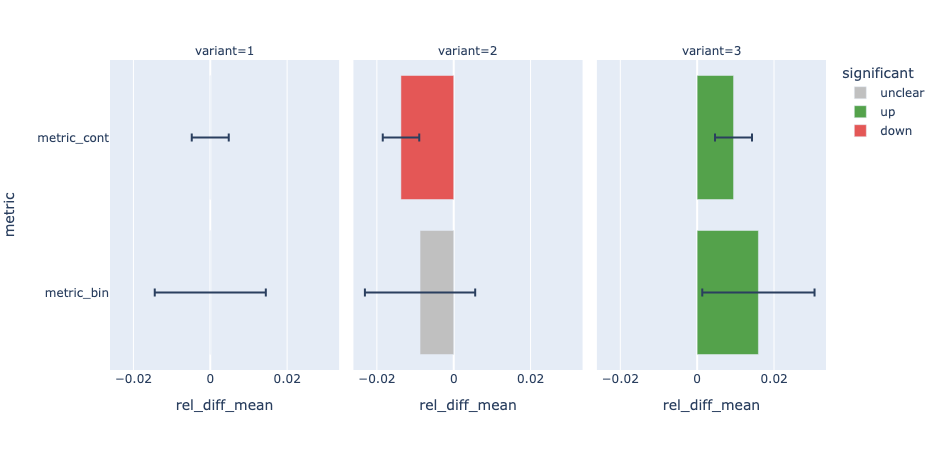
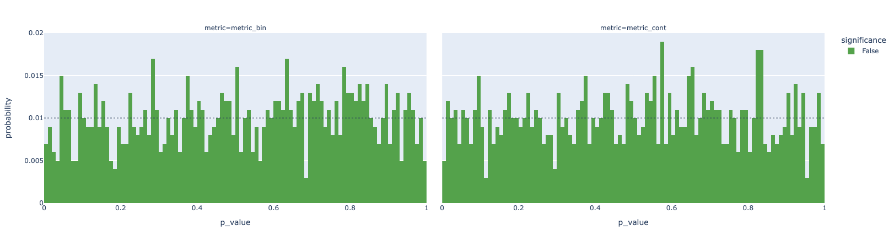
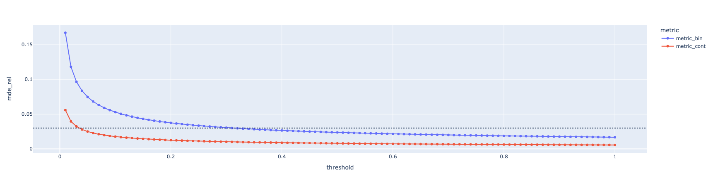

[](https://github.com/shyaginuma/casual_inference/actions/workflows/lint_and_test.yml)
[](https://badge.fury.io/py/casual_inference)

# casual_inference

The `casual_inference` is a Python package provides a simple interface to do causal inference.
Doing causal analyses is a complicated stuff. We have to pay attention to many things to do such analyses properly.
The `casual_inference` is developed aiming to reduce such effort.

## Installation

```shell
pip install casual-inference
```

## Overview

This package will provide several types of **`evaluator`**. They have `evaluate()` and some `summary_xxx()` methods. The `evaluate()` method evaluates treatment impact by calculating several statistics in it, and the `summary_xxx()` methods summarize such statistics in some ways. (e.g., table style, bar chart style, ...)

The `evaluate()` method expects that the data which has a schema like as follows will be passed.

|unit|variant|metric_A|metric_B|...|
|----|-------|--------|--------|---|
|1   |1      |0       |0.01    |...|
|2   |1      |1       |0.05    |...|
|3   |2      |0       |0.02    |...|
|... |...    |...     |...     |...|

The table has been already aggregated by the `unit` column. (i.e. The `unit` column should be the primary key)

### Columns

- `unit`: The unit you want to conduct analysis on. Typically it will be user_id, session_id, ... in the web service domain.
- `variant`: The group of intervention. This package always assumes `1` is a variant of control group.
- `metrics`: metrics you want to evaluate. e.g., The number of purchases, conversion rate, ...

## Quick Start

The current version of `casual_inference` only supports evaluation of A/B testing and A/A testing.

### A/B test evaluation

```python
from casual_inference.dataset import create_sample_ab_result
from casual_inference.evaluator import ABTestEvaluator

data = create_sample_ab_result(n_variant=3, sample_size=1000000, simulated_lift=[-0.01, 0.01])

evaluator = ABTestEvaluator()
evaluator.evaluate(
    data=data,
    unit_col="rand_unit",
    variant_col="variant",
    metrics=["metric_bin", "metric_cont"]
)

evaluator.summary_plot()
```



You can also see the [example notebook](https://github.com/shyaginuma/casual_inference/blob/main/examples/ab_test_evaluator.ipynb) to see more detailed example.

### A/A test evaluation

```python
from casual_inference.dataset import create_sample_ab_result
from casual_inference.evaluator import AATestEvaluator

data = create_sample_ab_result(n_variant=2, sample_size=1000000, simulated_lift=[0.0])

evaluator = AATestEvaluator()
evaluator.evaluate(
    data=data,
    unit_col="rand_unit",
    metrics=["metric_bin", "metric_cont"]
)

evaluator.summary_plot()
```



You can also see the [example notebook](https://github.com/shyaginuma/casual_inference/blob/main/examples/aa_test_evaluator.ipynb) to see more detailed example.

### Sample Size evaluation

```python
from casual_inference.dataset import create_sample_ab_result
from casual_inference.evaluator import SampleSizeEvaluator

data = create_sample_ab_result(n_variant=2, sample_size=1000000)

evaluator = SampleSizeEvaluator()
evaluator.evaluate(
    data=data,
    unit_col="rand_unit",
    metrics=["metric_bin", "metric_cont"]
)

evaluator.summary_plot()
```



You can also see the [example notebook](https://github.com/shyaginuma/casual_inference/blob/main/examples/sample_size_evaluator.ipynb) to see more detailed example.

## References

- Kohavi, Ron, Diane Tang, and Ya Xu. 2020. ​Trustworthy Online Controlled Experiments: A Practical Guide to A/B Testing. Cambridge University Press. https://experimentguide.com/
  - A Great book covering comprehensive topics around practical A/B testing. I do recommend to read this book for all people who works on A/B testing.
- Alex Deng, Ulf Knoblich, and Jiannan Lu. 2018. Applying the Delta Method in Metric Analytics: A Practical Guide with Novel Ideas. In Proceedings of the 24th ACM SIGKDD International Conference on Knowledge Discovery & Data Mining (KDD '18). Association for Computing Machinery, New York, NY, USA, 233–242. https://doi.org/10.1145/3219819.3219919
  - Describing how to approximate variance of relative difference, and when the analysis unit was more granular than the randomization unit.
- Lucile Lu. 2016. Power, minimal detectable effect, and bucket size estimation in A/B tests. Twitter Engineering Blog. [link](https://blog.twitter.com/engineering/en_us/a/2016/power-minimal-detectable-effect-and-bucket-size-estimation-in-ab-tests)
  - Describing Concept around Type I error and Type II error, Power Analysis. (Sample size calculation)
